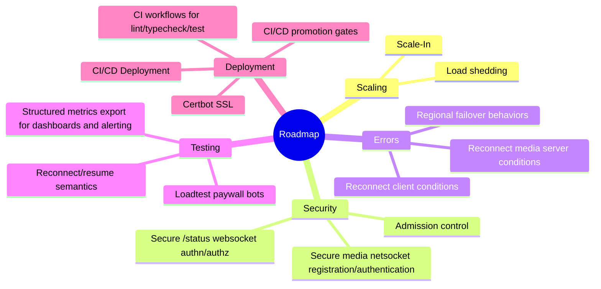

# Roadmap

Current release line: `0.1.0-alpha.1` (prerelease stabilization).

## Roadmap Mindmap

## Near Term

- stabilize diagnostics UX for peer/room incident analysis
- expand integration coverage for out-of-sequence media callbacks
- tighten error code taxonomy for user-impacting failures
- harden AWS deployment workflow and validation
- SSL provided by certbot
- secure `/status` websocket access (authn/authz)
- secure media netsocket registration/authentication
- add CI workflows for lint/typecheck/test enforcement

## Mid Term

- reconnect/resume semantics for websocket and media transport recovery
- extend authn/authz beyond media-server registration (tenant/client scope)
- structured metrics export for dashboards and alerting

## Longer Term

- regional failover behaviors
- admission control and overload shedding strategies
- hardened deployment profile with CI/CD release promotion gates
