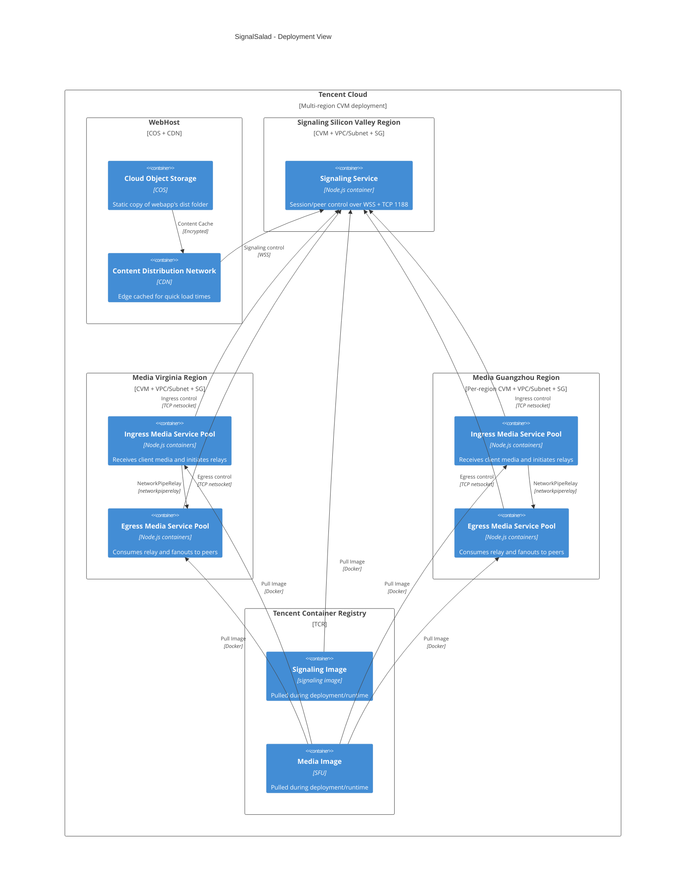

# C4 Deployment View

- Shows where runtime containers are placed in local dev and cloud regions.
- Shows deployment-time relationships between signaling and regional media pools.
- Omits code-level module wiring (covered in Level 3 code views).

## Out Of Scope

- Request/response control flows (Level 3 + Message Sequences).
- Browser UI behavior and state flow (Webapp Level 3).

## Notes

- Local deployment corresponds to `containerization/docker-compose.yml`.
- Cloud deployment applies to AWS/Tencent/Azure.
- Media can scale independently; media is modeled as regional pools.

## Next

- Container interactions: [C4 Level 2 - Container View](./c4-level2-container-view.md)
- Signaling internals: [C4 Level 3 - Signaling Code View](./c4-level3-signaling-components.md)
