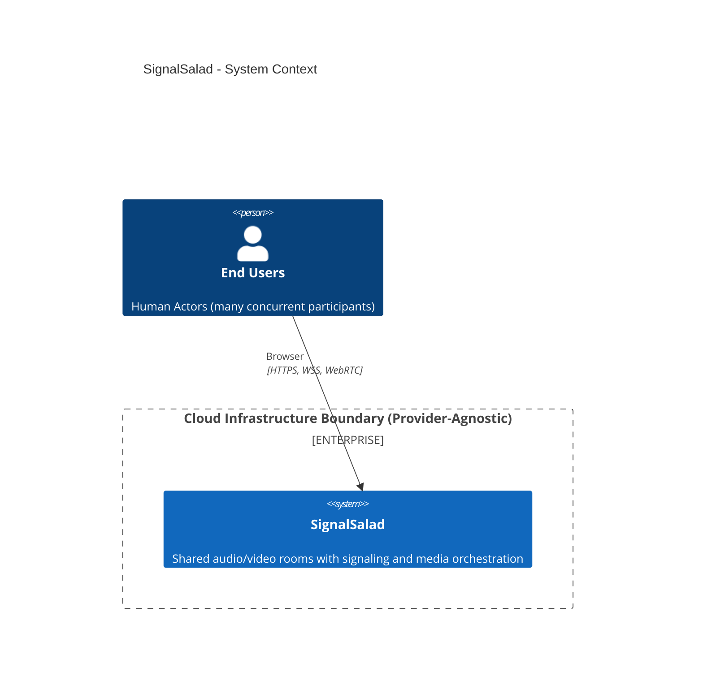

# C4 Level 1 - System Context

- Shows external actor(s) and the single system boundary.
- Shows the provider-agnostic cloud infrastructure boundary where SignalSalad runs.
- Intentionally omits internal containers and code modules.

## Who Uses The System

- `End Users`: join shared realtime room sessions from browsers.

## What The System Is

- `SignalSalad`: one logical multi-user realtime collaboration system for shared audio/video rooms over HTTPS/WSS/WebRTC.

## Out Of Scope

- Internal container boundaries (Level 2).
- Module-level code responsibilities (Level 3).

## Deployment Shape

- Deployment details are shown in [C4 Deployment View](./c4-deployment-view.md).

## Next

- Level 2 container at [C4 Level 2 - Container View](./c4-level2-container-view.md) and shows `webapp`, `signaling`, `ingress`, and `egress`.
- Level 3 details are split per container:
  - [Signaling Code View](./c4-level3-signaling-components.md)
  - [Ingress Code View](./c4-level3-ingress-code-view.md)
  - [Egress Code View](./c4-level3-egress-code-view.md)
  - [Webapp Code View](./c4-level3-webapp-code-view.md)
