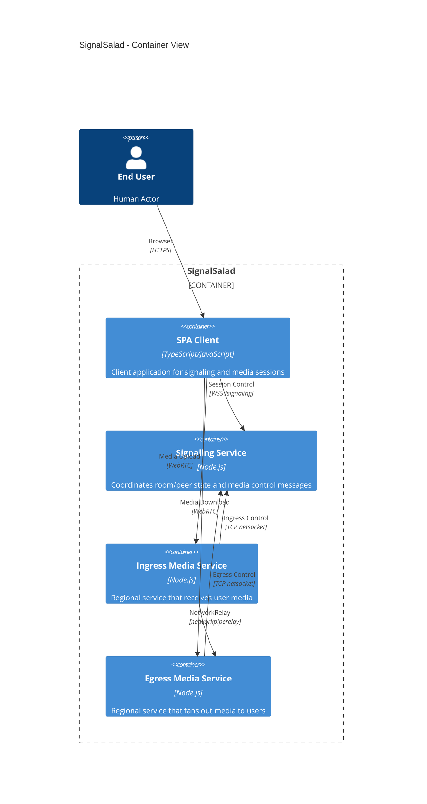

# C4 Level 2 - Container View

- Browser-facing path: `End User -> SPA Client`
- Control path: `SPA Client -> Signaling (WSS /signaling)`
- Media path: `SPA Client -> Ingress/Egress Media (WebRTC)`

## Summarized Flow

1. End user interacts with SPA client.
2. SPA client uses signaling for control plane.
3. SPA client uses ingress/egress for media plane.
4. Signaling controls media services over netsocket.
5. Ingress connects to egress to share media over network relay.

## Regional Model

- Media runs as regional pools, not single nodes.
- Each region can have one or more `ingress` and one or more `egress` servers.
- Signaling coordinates which ingress/egress servers are used per peer and room.

## Next

- Level 3 signaling code view: [C4 Level 3 - Signaling Code View](./c4-level3-signaling-components.md)
- Level 3 media and client code views:
  - [Ingress Code View](./c4-level3-ingress-code-view.md)
  - [Egress Code View](./c4-level3-egress-code-view.md)
  - [Webapp Code View](./c4-level3-webapp-code-view.md)
