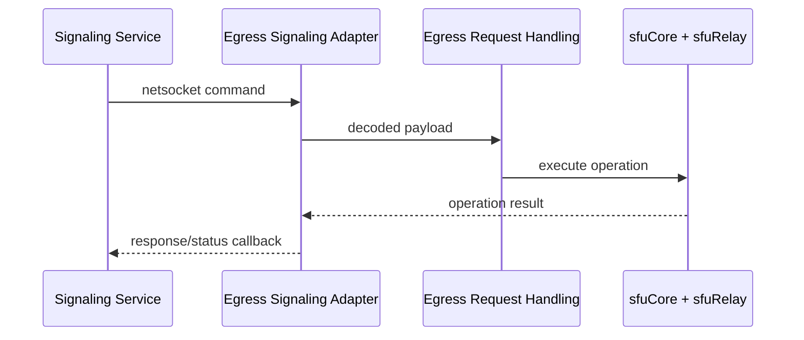
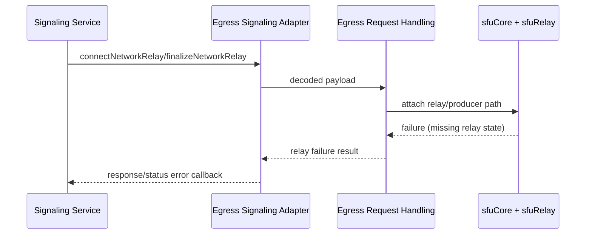
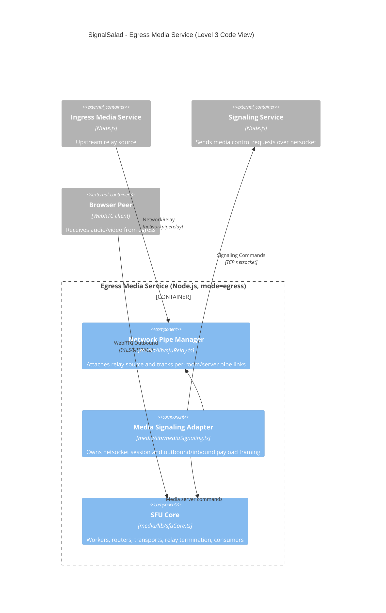

# C4 Level 3 - Egress Media Service Code View

- Shows the egress execution path inside the shared media service codebase.
- Focuses on relay termination, egress transport lifecycle, and consumer provisioning.
- Same binaries are used for ingress/egress; this view isolates egress-specific behavior.

## Interface Summary

- Inputs:
  - Netsocket commands from signaling (relay/transport/consumer control).
- Outputs:
  - Netsocket responses/status callbacks to signaling.
  - WebRTC downstream media to browser peers.
- State Ownership:
  - Owns egress-side SFU runtime stores used for relay termination and fanout (`routerGroups`, `transports`, `networkPipeTransports`, `pipeProducers`).

## Behavior Notes

- `Egress Signaling Adapter` (`media/lib/mediaSignaling.ts`)
  - Owns netsocket lifecycle, decode/encode, registration, and outbound responses.
  - Feeds decoded requests into `incomingNetsocketSignal`.
- `Egress Request Handling` (`incomingNetsocketSignal` + egress handlers in `media/lib/mediaSignaling.ts`)
  - Switch-routes relay setup/finalize, egress transport lifecycle, consumer creation, and teardown commands.
  - Executes signaling-issued media cleanup (`teardownPeerSession`) without owning session lifecycle decisions.
- `SFU Core` (`media/lib/sfuCore.ts`)
  - Owns mediasoup workers/routers/transports/consumers and runtime state maps.
- `Network Pipe Manager` (`media/lib/sfuRelay.ts`)
  - Owns relay-specific pipe transport lifecycle and relay producer wiring.

## Summarized Flow

1. Netsocket adapter receives a signaling command.
2. Inbound request router dispatches by `payload.type`.
3. Egress request handling chooses behavior path.
4. SFU core and relay manager execute operations and update state.
5. Adapter emits response/status callbacks to signaling.

## Runtime Sequence

## Failure Sequence

### Relay Termination Setup Failure (Egress Side)

## Module Mapping

- `Egress Signaling Adapter`: `media/lib/mediaSignaling.ts`
- `Egress Request Handling`: `media/lib/mediaSignaling.ts` (`incomingNetsocketSignal` + command handlers)
- `SFU Core`: `media/lib/sfuCore.ts`
- `Network Pipe Manager`: `media/lib/sfuRelay.ts`
