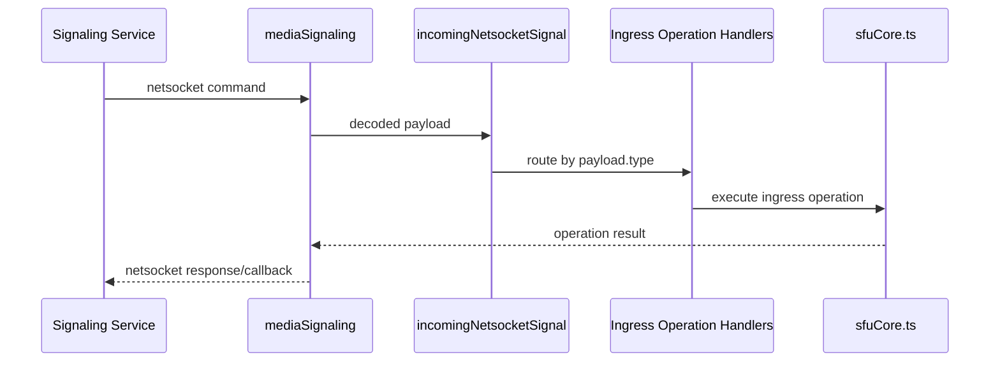
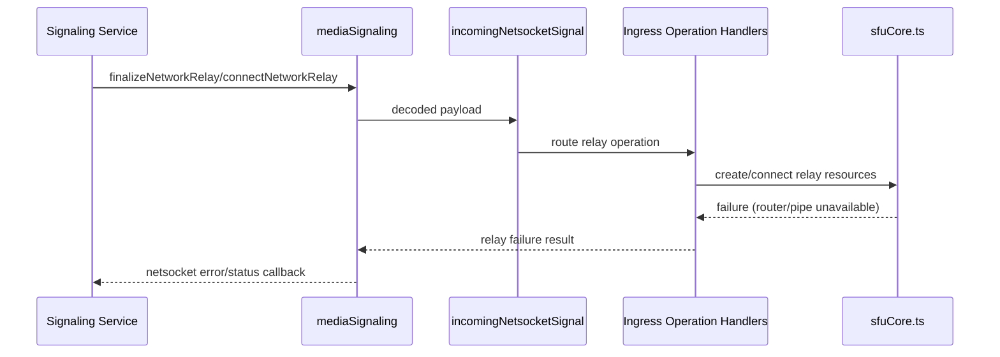
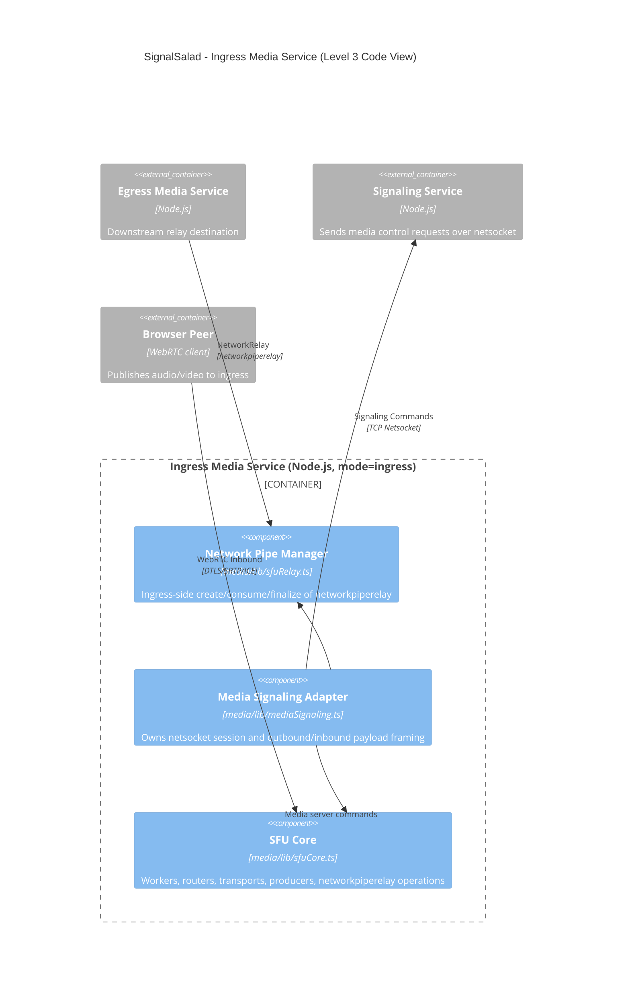

# C4 Level 3 - Ingress Media Service Code View

- Shows the ingress execution path inside the shared media service codebase.
- Focuses on direct code responsibilities and module boundaries.
- Same binaries are used for ingress/egress; this view isolates ingress-specific behavior.

## Interface Summary

- Inputs:
  - Netsocket commands from signaling (ingress control operations).
- Outputs:
  - Netsocket responses/status callbacks to signaling.
  - WebRTC media ingest from browser peers.
- State Ownership:
  - Owns ingress-side SFU runtime stores (`routerGroups`, `transports`, `producers`, `networkPipeTransports`, `pipeProducers`).

## Summarized Flow

1. Netsocket adapter receives a signaling command.
2. Inbound request router dispatches by `payload.type`.
3. Ingress operation handlers invoke SFU core operations.
4. SFU core updates transport/router/producer state.
5. Adapter emits response/status callbacks to signaling.

## Runtime Sequence

## Failure Sequence

### Relay Setup Failure (Ingress Side)

## Module Mapping

- `Media Signaling Adapter`: `media/lib/mediaSignaling.ts`
- `SFU Core`: `media/lib/sfuCore.ts`
- `Network Pipe Manager`: `media/lib/sfuRelay.ts`
