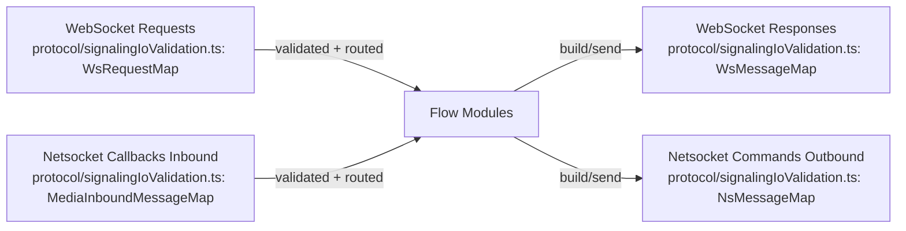
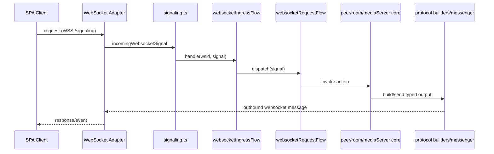
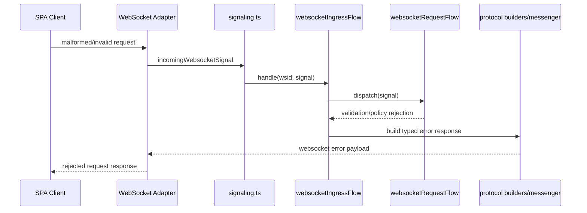
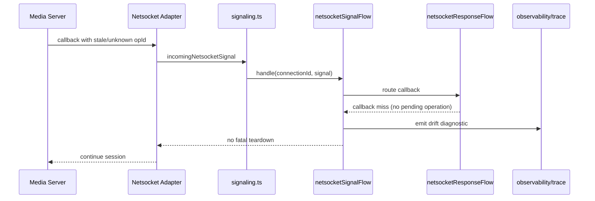
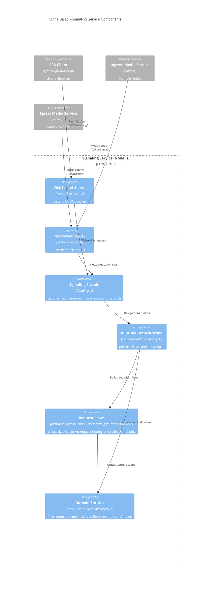

# C4 Level 3 - Signaling Code View

- Reflect signaling topology (listener adapters -> signaling facade -> runtime topology -> ingress wrappers -> flow modules -> core domains).
- Focuses on control-plane behavior: websocket/netsocket ingress handling, request routing, callback response mapping, room/peer/server lifecycle orchestration, and observability.

## Interface Summary

- Inputs:
  - WebSocket requests from SPA clients.
  - Netsocket callbacks/events from media services.
- Outputs:
  - WebSocket responses/events to SPA clients.
  - Netsocket commands to media services.
- State Ownership:
  - Owns control-plane lifecycle/state coordination for peer, room, and media-server domains.

## Summarized Flow

1. Listener adapters receive transport traffic (`WebSocket Server Adapter`, `Netsocket Server Adapter`).
2. `Signaling Facade` forwards lifecycle and message handling into the composed runtime.
3. `Runtime Topology` wires ingress wrappers + flow modules.
4. Flow modules invoke core domains and protocol contracts.
5. Observability collects diagnostics/status from ingress wrappers and runtime wiring.

## Networked Message Exchange

## Runtime Sequence

## Failure Sequences

### Rejected WebSocket Request

### Recoverable Netsocket Callback Drift

## Module Mapping

- `WebSocket Server Adapter`: `signaling/lib/listeners/websocketServer.ts`
- `Netsocket Server Adapter`: `signaling/lib/listeners/netsocketServer.ts`
- `Signaling Facade`: `signaling/lib/signaling/signaling.ts`
- `Runtime Orchestration`: `signaling/lib/signaling/signalingRuntimeTopology.ts`
- `Request Flows`:
  - `signaling/lib/signaling/websocketIngressFlow.ts`
  - `signaling/lib/signaling/netsocketSignalFlow.ts`
  - `signaling/lib/signaling/flows/websocketRequestFlow.ts`
  - `signaling/lib/signaling/flows/netsocketRequestFlow.ts`
  - `signaling/lib/signaling/flows/netsocketResponseFlow.ts`
- `Domain Services`:
  - `signaling/lib/core/peer/*`
  - `signaling/lib/core/room/*`
  - `signaling/lib/core/mediaServer/*`
- `Protocol + Observability`:
  - `signaling/lib/protocol/*`
  - `signaling/lib/observability/*`

## Message Sequences

- [All Systems Session Flow](../message-sequences/all-systems-session-flow.md)
- [Network Relay Handshake](../message-sequences/network-relay-handshake.md)
