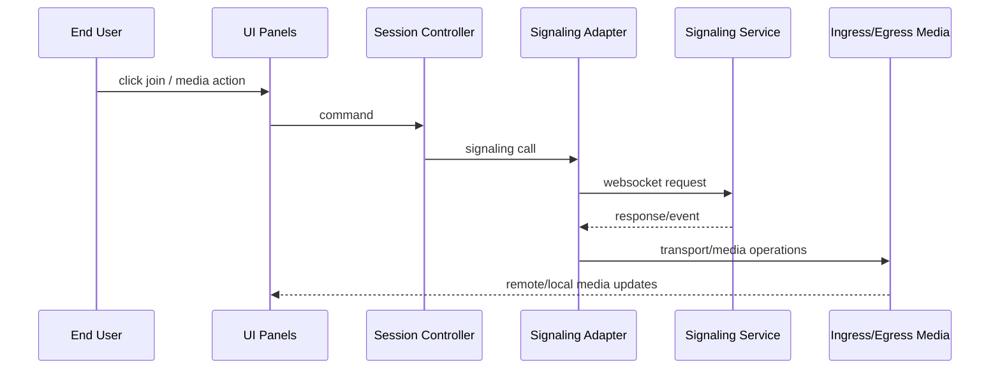
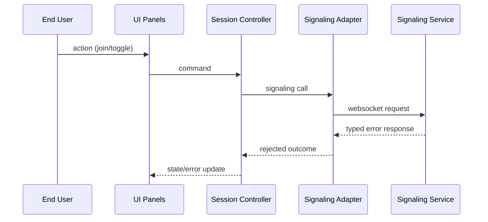
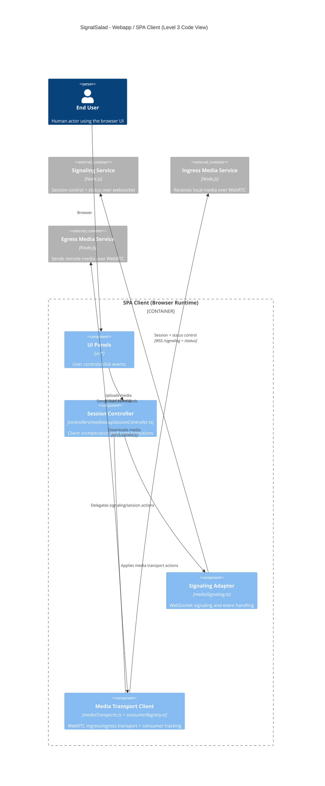

# C4 Level 3 - Webapp (SPA Client) Code View

- Shows how UI modules, controller, signaling adapter, and transport helpers fit together.
- Focuses on runtime browser flow (not webpack build pipeline internals).
- Includes `ConsumerRegistry` because consumer tracking is client-side in this repo.
- Models the current demo UI implementation; long-term UI replacement is expected to keep the harness contract stable.

## Interface Summary

- Inputs:
  - User UI actions (join/leave/toggle/mute).
  - WebSocket events and media transport events.
- Outputs:
  - WebSocket requests to signaling.
  - WebRTC transport/media operations to ingress/egress services.
- State Ownership:
  - Owns browser session/controller state and client-side consumer tracking.

## Summarized Flow

1. UI panels emit user actions to session controller.
2. Controller updates state via reducer and calls signaling adapter.
3. Signaling adapter exchanges websocket messages with signaling service.
4. Transport helpers apply media transport updates.
5. UI panels render status/media updates.

## Primary Runtime Path

1. UI panels emit user actions to `Session Controller`.
2. Controller updates reducer state and calls signaling adapter.
3. Adapter drives websocket signaling and mediasoup transport helpers.
4. Transport helpers connect ingress/egress WebRTC paths.
5. Status and media events flow back to controller/UI panels.

## Runtime Sequence

## Failure Sequence

### Rejected Signaling Request

## Module Mapping

- `UI Panels`: `webapp/lib/ui/*`
- `Session Controller`: `webapp/lib/controllers/mediasoupSessionController.ts`
- `Signaling Adapter`: `webapp/lib/signaling/mediaSignaling.ts`
- `Media Transport Client`: `webapp/lib/signaling/mediaTransports.ts`, `webapp/lib/signaling/consumerRegistry.ts`
