# All Systems Session Flow

This diagram captures a typical publisher/subscriber setup from identity to media announcements.
It reflects current signaling behavior where `joinedRoom` may be emitted for both ingress and egress router-group creation.
Ordering is representative for readability; some client actions (for example `produceMedia`) may occur earlier or later depending on UI timing.
The relay handshake segment shown below represents the cross-server producer/consumer case.

```mermaid
sequenceDiagram
    autonumber
    actor Pub as Publisher Client
    actor Sub as Subscriber Client
    participant WS as Signaling (WebSocket Flow)
    participant Peer as Peer/Room Domain
    participant NS as Signaling (Netsocket Flow)
    participant NSReq as netsocketRequestFlow
    participant NSResp as netsocketResponseFlow
    participant Relay as RoomRelay
    participant Ingress as Ingress Media Server
    participant Egress as Egress Media Server

    Pub->>WS: requestIdentity
    WS->>Peer: createPeer
    WS-->>Pub: identity
    Sub->>WS: requestIdentity
    WS->>Peer: createPeer
    WS-->>Sub: identity

    Pub->>WS: joinRoom
    WS->>Peer: joinRoom
    Peer->>Ingress: createRouterGroup (mode=ingress)
    Peer->>Egress: createRouterGroup (mode=egress)
    par join commit
        WS-->>Pub: roomAttached
    and media callbacks
        Ingress-->>NS: createdRouterGroup (mode=ingress)
        NS->>NSReq: dispatch(createdRouterGroup)
        NSReq->>NSResp: handleCreatedRouterGroupResponse
        NSResp-->>Pub: joinedRoom (mode=ingress)
    and
        Egress-->>NS: createdRouterGroup (mode=egress)
        NS->>NSReq: dispatch(createdRouterGroup)
        NSReq->>NSResp: handleCreatedRouterGroupResponse
        NSResp-->>Pub: joinedRoom (mode=egress)
    end

    Sub->>WS: joinRoom
    WS->>Peer: joinRoom
    Peer->>Ingress: createRouterGroup (mode=ingress)
    Peer->>Egress: createRouterGroup (mode=egress)
    par join commit
        WS-->>Sub: roomAttached (roomPeers includes Pub)
        WS-->>Pub: peerConnected (Sub)
    and media callbacks
        Ingress-->>NS: createdRouterGroup (mode=ingress)
        NS->>NSReq: dispatch(createdRouterGroup)
        NSReq->>NSResp: handleCreatedRouterGroupResponse
        NSResp-->>Sub: joinedRoom (mode=ingress)
    and
        Egress-->>NS: createdRouterGroup (mode=egress)
        NS->>NSReq: dispatch(createdRouterGroup)
        NSReq->>NSResp: handleCreatedRouterGroupResponse
        NSResp-->>Sub: joinedRoom (mode=egress)
    end

    Pub->>WS: createIngress
    WS->>Peer: createIngressTransport
    Peer->>Ingress: createWebRTCIngressTransport
    Ingress-->>NS: createdWebRTCIngressTransport
    NS->>NSReq: dispatch(createdWebRTCIngressTransport)
    NSReq-->>Pub: createdIngress
    Pub->>WS: connectIngress
    WS->>Peer: connectPeerTransport(ingress)
    Peer->>Ingress: connectWebRTCIngressTransport
    Ingress-->>NS: connectedWebRTCIngressTransport
    NS->>NSReq: dispatch(connectedWebRTCIngressTransport)
    NSReq-->>Pub: connectedIngress

    Sub->>WS: createIngress
    WS->>Peer: createIngressTransport
    Peer->>Ingress: createWebRTCIngressTransport
    Ingress-->>NS: createdWebRTCIngressTransport
    NS->>NSReq: dispatch(createdWebRTCIngressTransport)
    NSReq-->>Sub: createdIngress
    Sub->>WS: connectIngress
    WS->>Peer: connectPeerTransport(ingress)
    Peer->>Ingress: connectWebRTCIngressTransport
    Ingress-->>NS: connectedWebRTCIngressTransport
    NS->>NSReq: dispatch(connectedWebRTCIngressTransport)
    NSReq-->>Sub: connectedIngress

    Pub->>WS: createEgress
    WS->>Peer: createEgressTransport
    Peer->>Egress: createWebRTCEgressTransport
    Egress-->>NS: createdWebRTCEgressTransport
    NS->>NSReq: dispatch(createdWebRTCEgressTransport)
    NSReq-->>Pub: createdEgress
    Pub->>WS: connectEgress
    WS->>Peer: connectPeerTransport(egress)
    Peer->>Egress: connectWebRTCEgressTransport
    Egress-->>NS: connectedWebRTCEgressTransport
    NS->>NSReq: dispatch(connectedWebRTCEgressTransport)
    NSReq-->>Pub: connectedEgress

    Sub->>WS: createEgress
    WS->>Peer: createEgressTransport
    Peer->>Egress: createWebRTCEgressTransport
    Egress-->>NS: createdWebRTCEgressTransport
    NS->>NSReq: dispatch(createdWebRTCEgressTransport)
    NSReq-->>Sub: createdEgress
    Sub->>WS: connectEgress
    WS->>Peer: connectPeerTransport(egress)
    Peer->>Egress: connectWebRTCEgressTransport
    Egress-->>NS: connectedWebRTCEgressTransport
    NS->>NSReq: dispatch(connectedWebRTCEgressTransport)
    NSReq-->>Sub: connectedEgress

    Note over WS,Peer: roomEgressReady is emitted once required createdEgress mappings exist for all joined peers/routes.
    WS-->>Pub: roomEgressReady
    WS-->>Sub: roomEgressReady
    Pub->>WS: requestRoomAudio + requestRoomVideo
    Sub->>WS: requestRoomAudio + requestRoomVideo

    Pub->>WS: produceMedia
    WS->>Peer: createProducer
    Peer->>Ingress: createMediaProducer
    Ingress-->>NS: createdMediaProducer
    NS->>NSReq: dispatch(createdMediaProducer)
    NSReq->>NSResp: handleCreatedMediaProducerResponse
    NSResp->>Peer: record producer ownership
    NSResp-->>Pub: producedMedia

    Ingress-->>NS: initializedNetworkRelay
    NS->>NSReq: dispatch(initializedNetworkRelay)
    NSReq->>Relay: initializedNetworkRelay
    Relay->>Egress: connectNetworkRelay
    Egress-->>NS: connectedNetworkRelay
    NS->>NSReq: dispatch(connectedNetworkRelay)
    NSReq->>Relay: connectedNetworkRelay
    Relay->>Ingress: finalizeNetworkRelay
    Ingress-->>NS: finalizedNetworkRelay
    NS->>NSReq: dispatch(finalizedNetworkRelay)
    NSReq->>Relay: finalizedNetworkRelay
    Relay->>Egress: createConsumer
    Egress-->>NS: createdConsumer
    NS->>NSReq: dispatch(createdConsumer)
    NSReq->>NSResp: handleCreatedConsumerResponse
    NSResp-->>Sub: mediaAnnouncement
```

