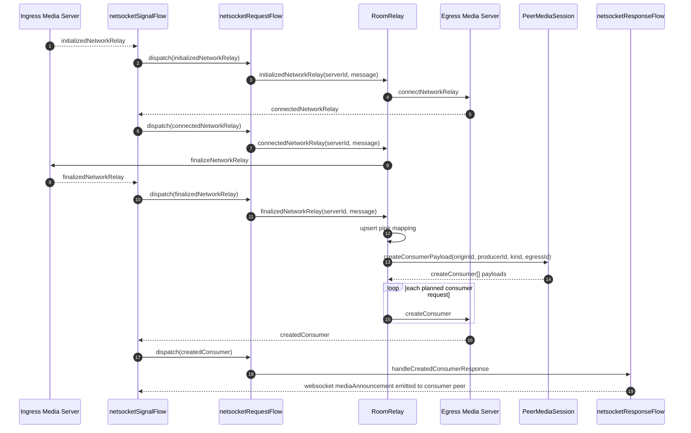

# Network Relay Handshake

This diagram documents the ingress/egress relay handshake used before cross-server consumer creation.

```mermaid
sequenceDiagram
    autonumber
    participant Ingress as Ingress Media Server
    participant NS as netsocketSignalFlow
    participant Req as netsocketRequestFlow
    participant Relay as RoomRelay
    participant Egress as Egress Media Server
    participant Planner as PeerMediaSession
    participant Mapper as netsocketResponseFlow

    Ingress-->>NS: initializedNetworkRelay
    NS->>Req: dispatch(initializedNetworkRelay)
    Req->>Relay: initializedNetworkRelay(serverId, message)
    Relay->>Egress: connectNetworkRelay

    Egress-->>NS: connectedNetworkRelay
    NS->>Req: dispatch(connectedNetworkRelay)
    Req->>Relay: connectedNetworkRelay(serverId, message)
    Relay->>Ingress: finalizeNetworkRelay

    Ingress-->>NS: finalizedNetworkRelay
    NS->>Req: dispatch(finalizedNetworkRelay)
    Req->>Relay: finalizedNetworkRelay(serverId, message)
    Relay->>Relay: upsert pipe mapping
    Relay->>Planner: createConsumerPayload(originId, producerId, kind, egressId)
    Planner-->>Relay: createConsumer[] payloads
    loop each planned consumer request
        Relay->>Egress: createConsumer
    end
    Egress-->>NS: createdConsumer
    NS->>Req: dispatch(createdConsumer)
    Req->>Mapper: handleCreatedConsumerResponse
    Mapper-->>NS: websocket mediaAnnouncement emitted to consumer peer
```
