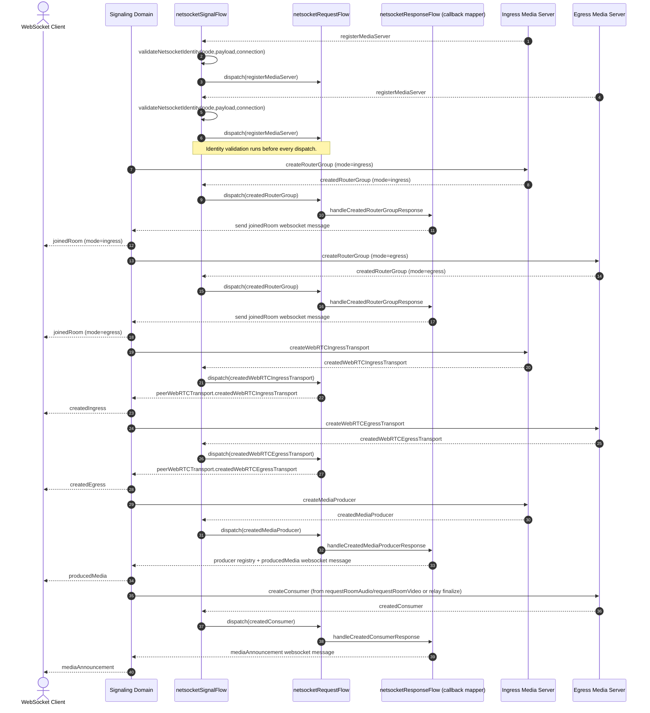

# Signaling <-> Media Server (Netsocket)

This diagram focuses on request/response control messages exchanged over netsocket between signaling and media servers.

```mermaid
sequenceDiagram
    autonumber
    actor Client as WebSocket Client
    participant Sig as Signaling Domain
    participant NS as netsocketSignalFlow
    participant Req as netsocketRequestFlow
    participant Resp as netsocketResponseFlow (callback mapper)
    participant Ingress as Ingress Media Server
    participant Egress as Egress Media Server

    Ingress-->>NS: registerMediaServer
    NS->>NS: validateNetsocketIdentity(node,payload,connection)
    NS->>Req: dispatch(registerMediaServer)
    Egress-->>NS: registerMediaServer
    NS->>NS: validateNetsocketIdentity(node,payload,connection)
    NS->>Req: dispatch(registerMediaServer)
    Note over NS,Req: Identity validation runs before every dispatch.

    Sig->>Ingress: createRouterGroup (mode=ingress)
    Ingress-->>NS: createdRouterGroup (mode=ingress)
    NS->>Req: dispatch(createdRouterGroup)
    Req->>Resp: handleCreatedRouterGroupResponse
    Resp-->>Sig: send joinedRoom websocket message
    Sig-->>Client: joinedRoom (mode=ingress)

    Sig->>Egress: createRouterGroup (mode=egress)
    Egress-->>NS: createdRouterGroup (mode=egress)
    NS->>Req: dispatch(createdRouterGroup)
    Req->>Resp: handleCreatedRouterGroupResponse
    Resp-->>Sig: send joinedRoom websocket message
    Sig-->>Client: joinedRoom (mode=egress)

    Sig->>Ingress: createWebRTCIngressTransport
    Ingress-->>NS: createdWebRTCIngressTransport
    NS->>Req: dispatch(createdWebRTCIngressTransport)
    Req-->>Sig: peerWebRTCTransport.createdWebRTCIngressTransport
    Sig-->>Client: createdIngress

    Sig->>Egress: createWebRTCEgressTransport
    Egress-->>NS: createdWebRTCEgressTransport
    NS->>Req: dispatch(createdWebRTCEgressTransport)
    Req-->>Sig: peerWebRTCTransport.createdWebRTCEgressTransport
    Sig-->>Client: createdEgress

    Sig->>Ingress: createMediaProducer
    Ingress-->>NS: createdMediaProducer
    NS->>Req: dispatch(createdMediaProducer)
    Req->>Resp: handleCreatedMediaProducerResponse
    Resp-->>Sig: producer registry + producedMedia websocket message
    Sig-->>Client: producedMedia

    Sig->>Egress: createConsumer (from requestRoomAudio/requestRoomVideo or relay finalize)
    Egress-->>NS: createdConsumer
    NS->>Req: dispatch(createdConsumer)
    Req->>Resp: handleCreatedConsumerResponse
    Resp-->>Sig: mediaAnnouncement websocket message
    Sig-->>Client: mediaAnnouncement
```
