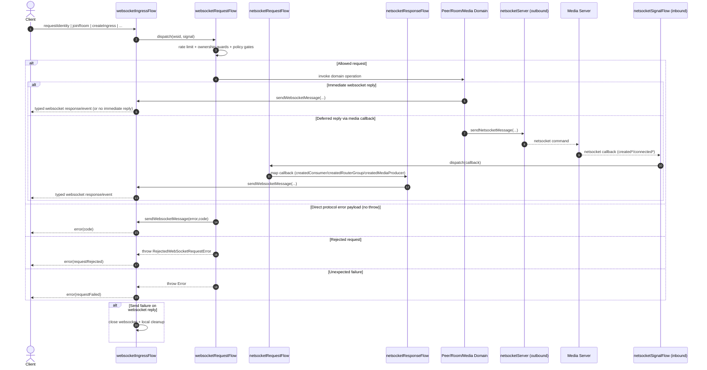

# Websocket Client <-> Signaling

This diagram focuses on websocket request dispatch, guard/policy checks, and typed websocket responses.

```mermaid
sequenceDiagram
    autonumber
    actor Client
    participant WS as websocketIngressFlow
    participant Disp as websocketRequestFlow
    participant NSReq as netsocketRequestFlow
    participant NSResp as netsocketResponseFlow
    participant Domain as Peer/Room/Media Domain
    participant Net as netsocketServer (outbound)
    participant Media as Media Server
    participant NS as netsocketSignalFlow (inbound)

    Client->>WS: requestIdentity | joinRoom | createIngress | ...
    WS->>Disp: dispatch(wsid, signal)
    Disp->>Disp: rate limit + ownership guards + policy gates

    alt Allowed request
        Disp->>Domain: invoke domain operation
        alt Immediate websocket reply
            Domain->>WS: sendWebsocketMessage(...)
            WS-->>Client: typed websocket response/event (or no immediate reply)
        else Deferred reply via media callback
            Domain->>Net: sendNetsocketMessage(...)
            Net-->>Media: netsocket command
            Media-->>NS: netsocket callback (created*/connected*)
            NS->>NSReq: dispatch(callback)
            NSReq->>NSResp: map callback (createdConsumer/createdRouterGroup/createdMediaProducer)
            NSResp->>WS: sendWebsocketMessage(...)
            WS-->>Client: typed websocket response/event
        end
    else Direct protocol error payload (no throw)
        Disp->>WS: sendWebsocketMessage(error,code)
        WS-->>Client: error(code)
    else Rejected request
        Disp-->>WS: throw RejectedWebSocketRequestError
        WS-->>Client: error(requestRejected)
    else Unexpected failure
        Disp-->>WS: throw Error
        WS-->>Client: error(requestFailed)
    end

    alt Send failure on websocket reply
        WS->>WS: close websocket + local cleanup
    end
```
