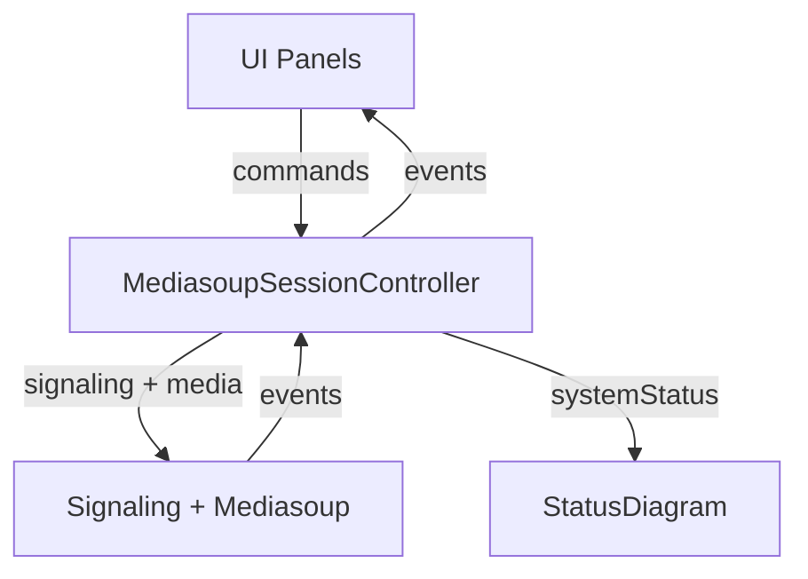

# Mediasoup Session Controller

MediasoupSessionController is the UI-facing integration layer for mediasoup-client. It gives
your UI one stable object to call (commands) and one stable stream to listen to
(events), while it owns all of the sequencing, transport wiring, and protocol
details on the browser side. Server-side mediasoup (routers/transports on the
media server) is reached through signaling and does not leak into UI code.

## Getting started

1. Create a controller with `new MediasoupSessionController(signalingUrl)`.
2. Register handlers for the events your UI cares about.
3. Call `connectSignaling()` when you are ready to connect.
4. Call `attachRoom(room)` when you are ready to join a room.

Minimal wiring example:

```ts
import { MediasoupSessionController } from "./mediasoupSessionController";
import { DownlinkPanel } from "../ui/downlinkPanel";
import { LocalMediaPanel } from "../ui/localMediaPanel";
import { StatusDiagram, StatusLegend } from "../ui/statusDiagram";

const signalingUrl = "wss://signaling.example.com";
const controller = new MediasoupSessionController(signalingUrl);
const downlink = new DownlinkPanel();
const diagram = new StatusDiagram();
const localPanel = new LocalMediaPanel();
const legend = new StatusLegend(controller, signalingUrl);

// Define actions to take on controller events.
controller.on("peerMediaOpened", (peerId, kind, track) => {
  if (kind === "audio") {
    downlink.attachAudio(peerId, track);
  } else {
    downlink.attachVideo(peerId, track);
  }
});
controller.on("peerMediaClosed", (peerId, kind) => {
  if (kind === "audio") {
    downlink.setAudioOff(peerId);
  } else if (kind === "video") {
    downlink.setVideoOff(peerId);
  }
});
controller.on("peerDisconnected", (peerId, room) => {
  downlink.removePeer(peerId);
  if (room) {
    console.log("Peer disconnected from room", room);
  }
});
controller.on("peerConnected", (peerId, room) => {
  console.log("Peer connected", peerId, room);
});
controller.on("identityAssigned", (selfId) => {
  localPanel.setIdentity(selfId);
  controller.attachRoom("demo");
});
controller.on("roomAttached", (room) => {
  localPanel.setRoomAttached(room);
});
controller.on("roomDetached", () => {
  localPanel.setRoomDetached();
});
controller.on("localMediaOpened", (kind, track, appData) => {
  localPanel.setLocalMediaOpened(kind, track, appData);
});
controller.on("localMediaClosed", (kind, appData) => {
  localPanel.setLocalMediaClosed(kind, appData);
});

// Set actions to take when UI buttons are pressed.
localPanel.setHandlers({
  onToggleAudio: () => controller.toggleMicrophone(),
  onToggleVideo: () => controller.toggleWebcam(),
  onJoinRoom: (room) => controller.attachRoom(room),
  onLeaveRoom: () => controller.detachRoom(),
});

// Mount UI elements just before connecting signaling.
downlink.mount();
diagram.mount();
localPanel.mount();
legend.mount();

// Establish signaling; room attach happens after identity is assigned.
controller.connectSignaling();
```

## Flow



## Concepts

- **Controller**: The UI-facing layer. It turns UI commands into system actions
  and emits events that represent real state changes.
- **Commands**: UI panels call explicit controller methods
  (`connectSignaling`, `attachRoom`, `toggleMicrophone`, `toggleWebcam`)
  so intent is always visible at the call site.
- **Events**: UI panels register handlers via `controller.on("event", handler)`.

## Event flow

Key inputs → controller events:

- `identityHandler` → `identityAssigned`.
- `roomAttachedHandler` → `roomAttached`.
- `roomDetachedHandler` → `roomDetached`.
- `transportSignalingStatusHandler` → `transportSignalingStatus`.
- `transportIngressStatusHandler` → `transportIngressStatus`.
- `transportEgressStatusHandler` → `transportEgressStatus`.
- `localAudioHandler` → `localMediaOpened`.
- `localVideoHandler` → `localMediaOpened`.
- `localMediaClosedHandler` → `localMediaClosed`.
- `peerConnectedHandler` → `peerConnected`.
- `peerDisconnectedHandler` → `peerDisconnected`.
- `peerAudioHandler` → `peerMediaOpened`.
- `peerVideoHandler` → `peerMediaOpened`.
- `peerScreenAudioHandler` → `peerMediaOpened`.
- `peerScreenVideoHandler` → `peerMediaOpened`.
- `peerMediaClosedHandler` → `peerMediaClosed`.

## Debugging

Set `localStorage.MEDIASOUP_SESSION_CONTROLLER_LOG_LEVEL = "trace"` to log
controller action + event flow from `trace.ts`. This is useful when wiring the
UI.
